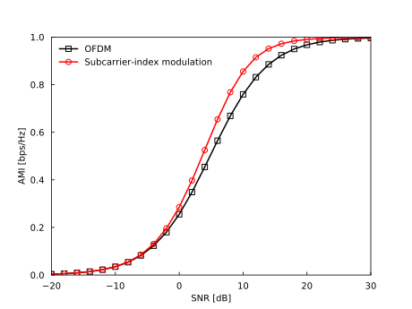

=================================
CoherentOFDM-IdealRayleigh-AMI.py
=================================

This webpage introduces an API example for the cohrent OFDM scenario, which uses ``CoherentMLDSimulator``.
Other examples are found in `tests/CoherentMLDSimulatorTest.py <https://github.com/imtoolkit/imtoolkit/blob/master/imtoolkit/tests/CoherentMLDSimulatorTest.py>`_.

This example compares the AMI performance of the coherent OFDM and subcarrier-index modulation schemes, where the simulation parameters are given in the table below.

Performance Results
===================

Simulation Parameters
=====================

+-----------------------------+--------------------------+
| Parameter                   | Value                    |
+=============================+==========================+
| Channel                     | Ideal Rayleigh fading    |
+-----------------------------+--------------------------+
| Number of subcarriers       | :math:`M=4`              |
+-----------------------------+--------------------------+
| Constellation size          | :math:`L=2,4`            |
+-----------------------------+--------------------------+
| Transmission rate           | :math:`R=1` [bps/Hz]     |
+-----------------------------+--------------------------+

Reproducible Code
=================

.. literalinclude:: ../../../imtoolkit/examples/CoherentOFDM-IdealRayleigh-AMI.py
   :language: python

Related Publications
====================
- [1] R. Abu-Alhiga and H. Haas, "`Subcarrier-index modulation OFDM <https://doi.org/10.1109/PIMRC.2009.5449882>`_," in IEEE 20th International Symposium on Personal, Indoor and Mobile Radio Communications, 2009.

- [2] E. Basar, U. Aygolu, E. Panayirci, and H. V. Poor, "`Orthogonal frequency division multiplexing with index modulation <https://doi.org/10.1109/TSP.2013.2279771>`_," IEEE Trans. Signal Process., vol. 61, no. 22, pp. 5536--5549, 2013.

- [3] M. Wen, Y. Zhang, J. Li, E. Basar, and F. Chen, "`Equiprobable subcarrier activation method for OFDM with index modulation <https://doi.org/10.1109/TSP.2013.2279771>`_," IEEE Commun. Lett., vol. 20, no. 12, pp. 2386--2389, 2016.

- [4] N. Ishikawa, S. Sugiura, and L. Hanzo, "`Subcarrier-index modulation aided OFDM -- will it work? <https://doi.org/10.1109/ACCESS.2016.2568040>`_," IEEE Access, vol. 4, pp. 2580--2593, 2016.

- [5] N. Ishikawa, S. Sugiura, and L. Hanzo, "`50 years of permutation, spatial and index modulation: From classic RF to visible light communications and data storage <https://doi.org/10.1109/COMST.2018.2815642>`_," IEEE Commun. Surv. Tutorials, vol. 20, no. 3, pp. 1905--1938, 2018.

- [6] N. Ishikawa, "`IMToolkit: An open-source index modulation toolkit for reproducible research based on massively parallel algorithms <https://doi.org/10.1109%2Faccess.2019.2928033>`_," IEEE Access, vol. 7, pp. 93830--93846, July 2019.
