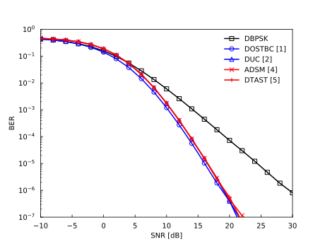

=====================================
DifferentialMIMO-IdealRayleigh-BER.py
=====================================

This webpage introduces an API example for the noncohrent scenario, which uses :doc:`DifferentialMLDSimulator <../module/imtoolkit.DifferentialMLDSimulator>`.
Other examples are found in :doc:`DifferentialMLDSimulatorTest <../module/imtoolkit.tests.DifferentialMLDSimulatorTest>`.

This example compares the BER performance of the differential BPSK, differential orthogonal space-time block code (DOSTBC), diagonal unitary code (DUC), algebraic differential spatial modulation (ADSM), and differential threaded algebraic space-time (DTAST) schemes.
The simulation parameters are given in the table below.

Performance Results
===================

Simulation Parameters
=====================

+-----------------------------+----------------------------------+
| Parameter                   | Value                            |
+=============================+==================================+
| Channel                     | Ideal Rayleigh fading            |
+-----------------------------+----------------------------------+
| Number of transmit antennas | :math:`M=2`                      |
+-----------------------------+----------------------------------+
| Number of receive antennas  | :math:`N=2`                      |
+-----------------------------+----------------------------------+
| Constellation size          | :math:`L=2,4`                    |
+-----------------------------+----------------------------------+
| Transmission rate           | :math:`R=B/T=2/2=1` [bit/symbol] |
+-----------------------------+----------------------------------+

Reproducible Code
=================

.. literalinclude:: ../../../imtoolkit/examples/DifferentialMIMO-IdealRayleigh-BER.py
   :language: python

Related Publications
====================
- [1] S. Alamouti, "`A simple transmit diversity technique for wireless communications <https://doi.org/10.1109/49.730453>`_," IEEE J. Sel. Areas Commun., vol. 16, no. 8, pp. 1451--1458, 1998.

- [2] B. M. Hochwald and W. Sweldens, "`Differential unitary space-time modulation <https://doi.org/10.1109/26.891215>`_," IEEE Trans. Commun., vol. 48, no. 12, pp. 2041--2052, 2000.

- [3] R. Rajashekar, N. Ishikawa, S. Sugiura, K. V. S. Hari, and L. Hanzo, "`Full-diversity dispersion matrices from algebraic field extensions for differential spatial modulation <https://doi.org/10.1109/TVT.2016.2536802>`_," IEEE Trans. Veh. Technol., vol. 66, no. 1, pp. 385--394, 2017.

- [4] R. Rajashekar, C. Xu, N. Ishikawa, S. Sugiura, K. V. S. Hari, and L. Hanzo, "`Algebraic differential spatial modulation is capable of approaching the performance of its coherent counterpart <https://doi.org/10.1109/TCOMM.2017.2720170>`_," IEEE Trans. Commun., vol. 65, no. 10, pp. 4260--4273, 2017.

- [5] C. Xu, P. Zhang, R. Rajashekar, N. Ishikawa, S. Sugiura, L. Wang, and L. Hanzo, "`Finite-cardinality single-RF differential space-time modulation for improving the diversity-throughput tradeoff <https://doi.org/10.1109/TCOMM.2018.2869812>`_," IEEE Trans. Commun. Press, vol. 67, no. 1, pp. 318--335, 2019.

- [6] C. Xu, R. Rajashekar, N. Ishikawa, S. Sugiura, and L. Hanzo, "`Single-RF index shift keying aided differential space-time block coding <https://doi.org/10.1109/TSP.2017.2768019>`_," IEEE Trans. Signal Process., vol. 66, no. 3, pp. 773--788, 2018.

- [7] C. Xu, P. Zhang, R. Rajashekar, N. Ishikawa, S. Sugiura, Z. Wang, and L. Hanzo, "`Near-perfect finite-cardinality generalized space-time shift keying <https://doi.org/10.1109/JSAC.2019.2929450>`_," IEEE J. Sel. Areas Commun., in press.

- [8] N. Ishikawa, "`IMToolkit: An open-source index modulation toolkit for reproducible research based on massively parallel algorithms <https://doi.org/10.1109%2Faccess.2019.2928033>`_," IEEE Access, vol. 7, pp. 93830--93846, July 2019.

