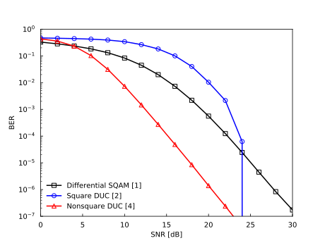

==============================================
NonSquareDifferentialMIMO-IdealRayleigh-BER.py
==============================================

This webpage introduces an API example for the noncohrent scenario, which uses :doc:`NonSquareDifferentialMLDSimulator <../module/imtoolkit.NonSquareDifferentialMLDSimulator>`.
Other examples are found in :doc:`NonSquareDifferentialMLDSimulatorTest <../module/imtoolkit.tests.NonSquareDifferentialMLDSimulatorTest>`.

This example compares the BER performance of the differential star-QAM (SQAM), square diagonal unitary code (DUC), and nonsquare DUC schemes.
The simulation parameters are given in the table below.

Performance Results
===================

Simulation Parameters
=====================

+-----------------------------+----------------------------------+
| Parameter                   | Value                            |
+=============================+==================================+
| Channel                     | Ideal Rayleigh fading            |
+-----------------------------+----------------------------------+
| Number of transmit antennas | :math:`M=4`                      |
+-----------------------------+----------------------------------+
| Number of receive antennas  | :math:`N=4`                      |
+-----------------------------+----------------------------------+
| Constellation size          | :math:`L=16,65536`               |
+-----------------------------+----------------------------------+
| Transmission rate           | :math:`R=4` [bit/symbol]         |
+-----------------------------+----------------------------------+

Reproducible Code
=================

.. literalinclude:: ../../../imtoolkit/examples/NonSquareDifferentialMIMO-IdealRayleigh-BER.py
   :language: python

Related Publications
====================
- [1] W. T. Webb, L. Hanzo, and R. Steele, "`Bandwidth efficient QAM schemes for Rayleigh fading channels <https://ieeexplore.ieee.org/document/98701>`_," IEE Proc., vol. 138, no. 3, pp. 169--175, 1991.

- [2] B. M. Hochwald and W. Sweldens, "`Differential unitary space-time modulation <https://doi.org/10.1109/26.891215>`_," IEEE Trans. Commun., vol. 48, no. 12, pp. 2041--2052, 2000.

- [3] R. Rajashekar, C. Xu, N. Ishikawa, S. Sugiura, K. V. S. Hari, and L. Hanzo, "`Algebraic differential spatial modulation is capable of approaching the performance of its coherent counterpart <https://doi.org/10.1109/TCOMM.2017.2720170>`_," IEEE Trans. Commun., vol. 65, no. 10, pp. 4260--4273, 2017.

- [4] N. Ishikawa and S. Sugiura, "`Rectangular differential spatial modulation for open-loop noncoherent massive-MIMO downlink <https://doi.org/10.1109/TWC.2017.2657497>`_," IEEE Trans. Wirel. Commun., vol. 16, no. 3, pp. 1908--1920, 2017.

- [5] N. Ishikawa, R. Rajashekar, C. Xu, S. Sugiura, and L. Hanzo, "`Differential space-time coding dispensing with channel-estimation approaches the performance of its coherent counterpart in the open-loop massive MIMO-OFDM downlink <https://doi.org/10.1109/TCOMM.2018.2867528>`_," IEEE Trans. Commun., vol. 66, no. 12, pp. 6190--6204, 2018.

- [6] N. Ishikawa, R. Rajashekar, C. Xu, M. El-Hajjar, S. Sugiura, L. L. Yang, and L. Hanzo, "`Differential-detection aided large-scale generalized spatial modulation is capable of operating in high-mobility millimeter-wave channels <https://doi.org/10.1109%2Fjstsp.2019.2913130>`_," IEEE J. Sel. Top. Signal Process., in press.

- [7] N. Ishikawa, "`IMToolkit: An open-source index modulation toolkit for reproducible research based on massively parallel algorithms <https://doi.org/10.1109%2Faccess.2019.2928033>`_," IEEE Access, vol. 7, pp. 93830--93846, July 2019.

