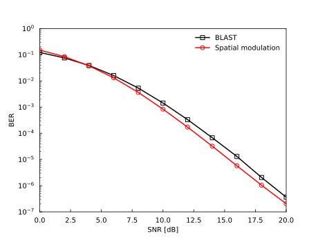

========
Tutorial
========

This webpage introduces a detailed tutorial for the ``imtoolkit`` command and APIs. Before using the command and the APIs, the CuPy-aided GPGPU acceleration is activated by setting an environment variable ``USECUPY=1`` as follows.

.. code-block:: bash

    > export USECUPY=1

In case you would like to use the CPU backend, NumPy, please unset the environment variable.

.. code-block:: bash

    > unset USECUPY

.. toctree::
   :maxdepth: 2
   :hidden:

   imtoolkit-command
   CoherentMIMO-IdealRayleigh-BER
   CoherentMIMO-IdealRayleigh-AMI
   CoherentOFDM-IdealRayleigh-BER
   CoherentOFDM-IdealRayleigh-BER-diversity
   CoherentOFDM-IdealRayleigh-AMI

.. raw:: html

   <h2>How to use the imtoolkit command</h2>

- :doc:`Tutorial for the installed imtoolkit command. <imtoolkit-command>`

.. raw:: html

   <h2>API examples for the imtoolkit package</h2>

- :doc:`CoherentMIMO-IdealRayleigh-BER.py <CoherentMIMO-IdealRayleigh-BER>`

    - This example compares the BER performance of the coherent BLAST and spatial modulation schemes

.. raw:: html

    

.. image:: ../../../imtoolkit/examples/CoherentMIMO-IdealRayleigh-AMI.svg
   :align: right
   :width: 150px
   :target: CoherentMIMO-IdealRayleigh-AMI.html

- :doc:`CoherentMIMO-IdealRayleigh-AMI.py <CoherentMIMO-IdealRayleigh-AMI>`

    - This example compares the AMI performance of the coherent BLAST and spatial modulation schemes

.. raw:: html

    

.. image:: ../../../imtoolkit/examples/CoherentOFDM-IdealRayleigh-BER.svg
   :align: right
   :width: 150px
   :target: CoherentOFDM-IdealRayleigh-BER.html

- :doc:`CoherentOFDM-IdealRayleigh-BER.py <CoherentOFDM-IdealRayleigh-BER>`

    - This example compares the BER performance of the coherent OFDM and subcarrier-index modulation schemes.

.. raw:: html

    

.. image:: ../../../imtoolkit/examples/CoherentOFDM-IdealRayleigh-BER-diversity.svg
   :align: right
   :width: 150px
   :target: CoherentOFDM-IdealRayleigh-BER-diversity.html

- :doc:`CoherentOFDM-IdealRayleigh-BER-diversity.py <CoherentOFDM-IdealRayleigh-BER-diversity>`

    - This example evaluates the BER performance of the coherent subcarrier-index modulation scheme, where three subcarrier activation patterns are considered.

.. raw:: html

    

.. image:: ../../../imtoolkit/examples/CoherentOFDM-IdealRayleigh-AMI.svg
   :align: right
   :width: 150px
   :target: CoherentOFDM-IdealRayleigh-AMI.html

- :doc:`CoherentOFDM-IdealRayleigh-AMI.py <CoherentOFDM-IdealRayleigh-AMI>`

    - This example compares the AMI performance of the coherent OFDM and subcarrier-index modulation schemes.

.. raw:: html

    

